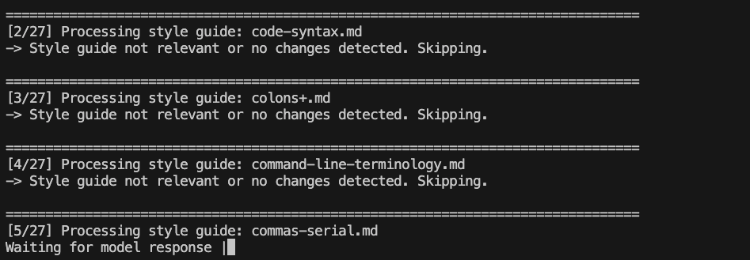

# docs-style

Review and edit documentation with a curated adaptation of the
[Google Developer Documentation Style Guide](https://developers.google.com/style).
The repository provides an agent skill for Markdown and a Python editor, AutoDocsEditor,
for Markdown and Jupyter notebooks.

## Agent skill

The [docs-style skill](skills/docs-style/SKILL.md) contains the editing workflow.
Plugin manifests for Claude Code and Codex live at the repository root; the skill
and its resources live under `skills/docs-style/`.

Use requests such as these:

- “Review README.md for Google documentation style.”
- “Apply docs-style to docs/setup.md.”
- “Do a final style pass on docs/tutorial.md.”

The skill reads the relevant curated rules, reports findings or edits according
to the request, and requires a Vale check. It can combine related corrections;
ask for staged review if you want to approve each round.

## Python editor

From a checkout with Python 3.12 or later and uv installed, install dependencies
and open a document in the terminal user interface (TUI):

```shell
uv sync --locked
uv run --locked vale --version
export OPENAI_API_KEY="YOUR_API_KEY"
uv run docs-style-tui docs/your_article.md
```

Replace `YOUR_API_KEY` with your API key and `docs/your_article.md` with the path
to your Markdown file in these examples.

You can also put the API key in the `.env` file; see the
[sample environment file](.env.SAMPLE).
To select the model, set `MODEL_NAME` in [settings.py](settings.py).
Langfuse tracing is optional and enabled when its credentials are set.



The TUI shows proposed edits with context and a reason. Press `a` to accept,
`r` to reject, `s` to skip the current guide, or `q` to quit.
Vale enforcement runs automatically before and after the guide passes and
can edit the document without individual approval, including in TUI mode.

The command-line interface (CLI) applies edits and pauses after each guide that
changes the document:

```shell
uv run docs-style-edit docs/your_article.md
```

Use `--yolo` to skip those pauses. Both interfaces write changes to the target
file; neither commits them to Git. `python main.py tui ...` and
`python main.py cli ...` are alternative entry points.

### Notebooks

Both interfaces accept `.ipynb` files:

```shell
uv run docs-style-tui notebooks/tutorial.ipynb
```

Jupytext creates a paired MyST Markdown file for editing. The editor syncs it
back to the notebook on completion and preserves the Markdown file. An existing
Markdown file must already be paired with the notebook before it can be reused.
Replace `notebooks/tutorial.ipynb` with the path to your notebook.

### Resume or run a final pass

`--skip-through` skips a named guide and all preceding guides:

```shell
uv run docs-style-tui --skip-through 01-lists.md docs/your_article.md
```

`--final-pass` selects guides whose filenames end in `+.md`:

```shell
uv run docs-style-edit --final-pass docs/your_article.md
```

These options work in both interfaces. Guide filenames and their order are in
[references/style](skills/docs-style/references/style/).

## Vale

Vale is required for the Python editor and agent skill. The Python dependency
list and lockfile include the [Vale package](https://pypi.org/project/vale/).
The package downloads its matching executable on first use, so run
`uv run --locked vale --version` during setup while network access is available.
The skill includes its configuration and Google rule bundle; no rule download
is needed.

For a standalone skill installation, follow the
[Vale installation instructions](https://docs.vale.sh/topics/installation) and
make `vale` available on `PATH`. A missing executable or failed Vale check
blocks the workflow; style findings still require editorial judgment.

To lint without the Python editor or a large language model (LLM), use the
bundled wrapper:

```shell
uv run --locked bash skills/docs-style/scripts/vale_check.sh docs/your_article.md
```

This wrapper reports findings only. The Python editor's Vale step additionally
uses an LLM to apply fixes.

## Bulk draft PRs

[bulk_pr_autodocs.py](bulk_pr_autodocs.py) processes Markdown paths listed in a
text file, one path per line relative to an existing local clone. Blank lines
and lines beginning with `#` are ignored.
Each edited document becomes a draft pull request (PR).

Set `OPENAI_API_KEY` and `GITHUB_TOKEN`, then run:

```shell
uv run --script bulk_pr_autodocs.py \
    --repo /path/to/local/clone \
    --greenlist greenlist.txt
```

Replace `/path/to/local/clone` with the path to your clone and `greenlist.txt`
with the path to your list of Markdown files.

The script checks out the base branch, creates a document branch, runs the
editor twice (full and final passes) with `--yolo`, commits and pushes the result,
then opens a draft PR. It uploads the final session log to a secret gist and
archives a local copy under `logs/bulk_pr_logs/`. The GitHub token must allow the
repository operations and gist creation.

Use a clean clone: the script switches branches and resets an existing branch
with the same generated name. `--base-branch` and `--remote` select the target;
`--continue-on-error` continues with later documents after a failure.
`--dry-run` prints commands without executing them; it cannot predict the edits
or PRs that a real run produces.

## Curated rules

The reference files consolidate the original guide into topics. They include
local preferences and omit some Google-specific, HTML-specific, and irrelevant
material. Unused source pages remain in [archive/](archive/); the crawler in
[crawl/](crawl/) is a maintenance tool, not part of editing.

The Python editor applies guides in filename order: broad principles first,
then structure and terminology, followed by mechanics. The agent skill uses
the same references with discretion about how to group edits. Technical accuracy,
repository conventions, and explicit user preferences take precedence over
mechanical compliance.

See [Testing](docs/testing.md) for development checks.
